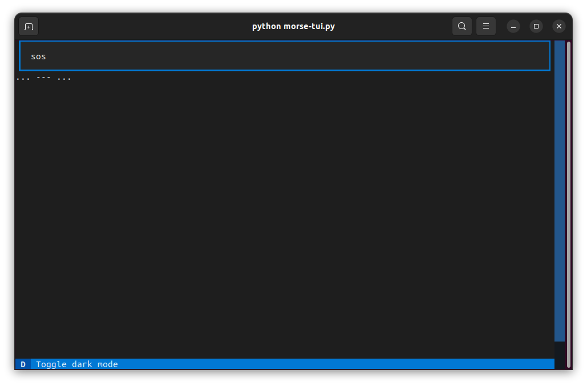
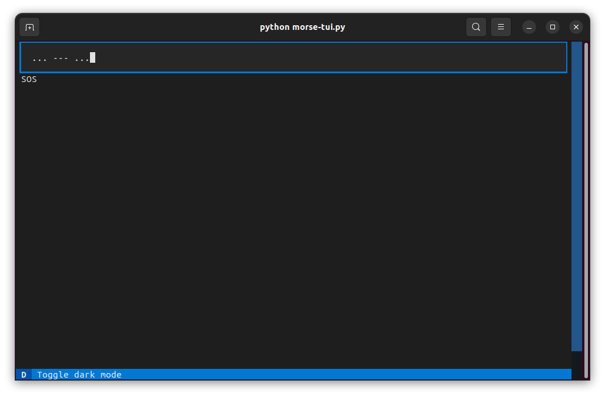

# morse-tui

Type a text or morse code.


Morse code words are separated by one space and morse code sentences are separated by 3 spaces.




## Install

clone this repo and install requirements

```
pip install -r requirements.txt
```


## Disclaimer

This is only a little testing app where I try to understand pydantic, textual and morse code.