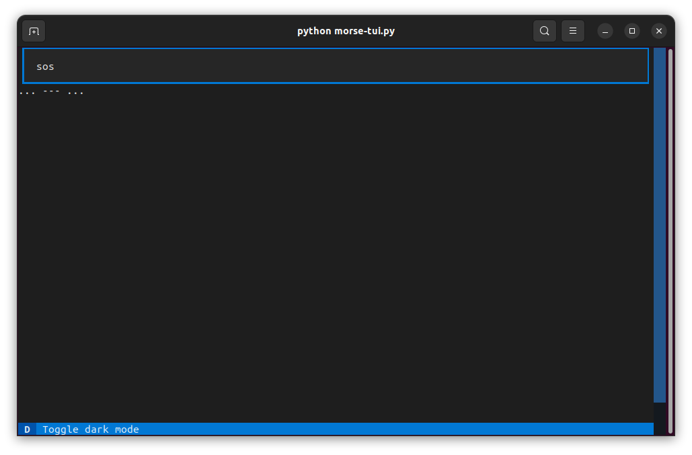
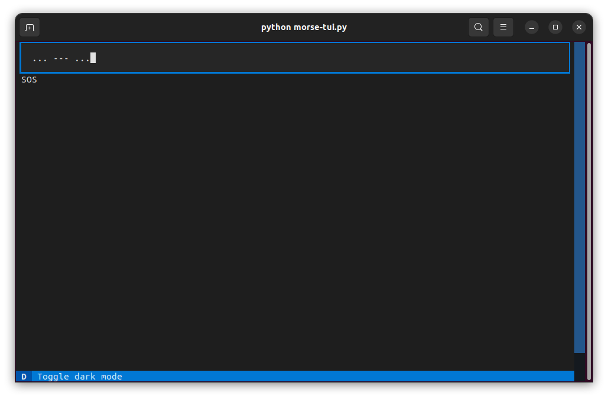

# morse-tui

A terminal UI for encoding and decoding Morse code in real time.




## Usage

Type plain text and it is encoded to Morse code on the fly. Type Morse code and it is decoded to plain text automatically — the app detects which direction you are going.

**Morse input format**

| Separator | Meaning |
|---|---|
| 1 space | between characters |
| 2 spaces | between words |
| 3 spaces or newline | between sentences |

You can use either a standard ASCII dot `.` or the middle dot `·` character. Dashes are standard hyphens `-`.

**Keyboard shortcuts**

| Key | Action |
|---|---|
| `d` | Toggle dark / light mode |
| `ctrl+c` | Quit |

**Supported characters**

A–Z, 0–9, extended Latin (À Ä È É Ö Ü ß Ñ), common punctuation, and prosigns (SOS, KA, BT, AR, VE, SK, HH).

## Install

```
git clone https://github.com/Vherolf/morse-tui
cd morse-tui
python -m venv venv
source venv/bin/activate
pip install -r requirements.txt
python morse-tui.py
```

## Requirements

- Python 3.10+
- [Textual](https://github.com/Textualize/textual) 8.x
- [Pydantic](https://docs.pydantic.dev/) 2.x
